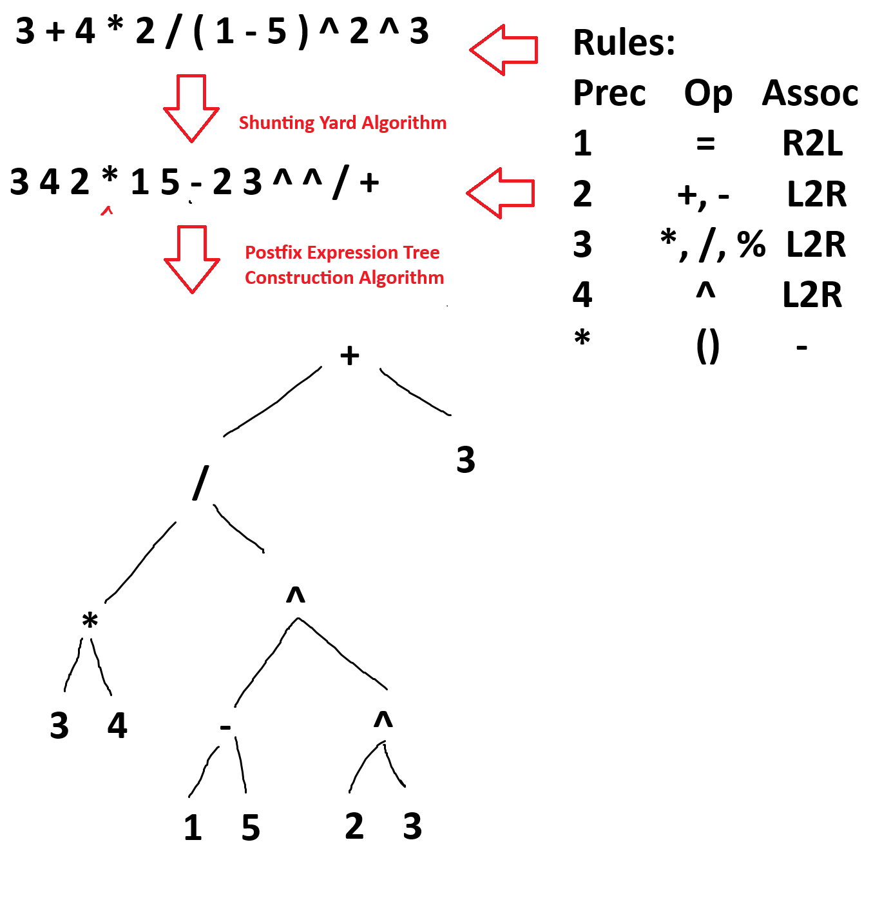

# `Aritree`

Arithmetic expressions visualized in a binary tree representation.


### TODO

- [ ] Allow changing rules in table view
- [ ] More operators?
- [ ] Stepper?

## Design

In a nutshell,



## Developing

Once you've created a project and installed dependencies with `npm install`, start a development server:

```bash
npm run dev

# or start the server and open the app in a new browser tab
npm run dev -- --open
```

## REF
- http://faculty.nps.edu/kmsquire/cs3901/section1/projects/p2/arithmetic.pdf
- https://brilliant.org/wiki/shunting-yard-algorithm/
